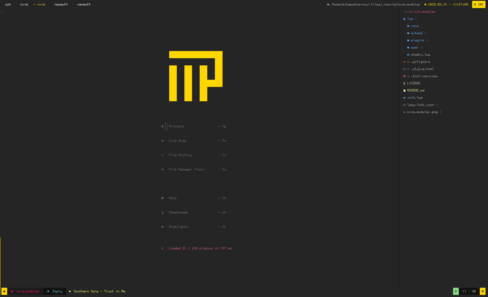

# nvim.modular

---

## introduction

a configuration for neovim based on [nvchad](https://github.com/NvChad/starter) and inspired by [kickstart.nvim](https://github.com/nvim-lua/kickstart.nvim)
in combination with [mini.nvim](https://github.com/echasnovski/mini.nvim) modules that includes
qol improvements for people migrating from ide's like vscode or phpstorm / intellij

---

* modular
* comprehensive
* geared towards [drupal](https://drupal.org) development

---

